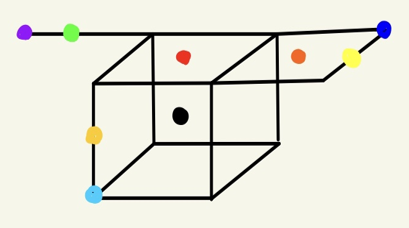
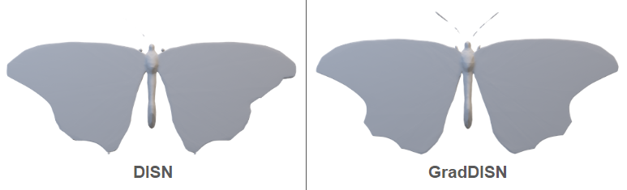

# GradDISN: Deep Implicit Surface Network with Gradient-based Loss for Detailed 3D Reconstruction
We propose incoporating occupancy gradients into the loss function to achieve more accurate reconstruction of fine-grained details in 3D mesh.
This implementation is based on [DISN](https://github.com/laughtervv/DISN). Please refer to the [README](https://github.com/laughtervv/DISN/blob/master/README.md) for general instructions, with specific exceptions noted in the "Prepare SDF files and marching cube ground truth model" section under 'Data Preparation' below.

To generate SDF files for GradDISN, we have added a 'model' argument to argparse, allowing you to select between the original 'DISN' and 'GradDISN'. The default setting is 'GradDISN', but you can choose 'DISN' if you prefer to run the original version.
  ```
  mkdir log
  cd {DISN}
  source isosurface/LIB_PATH
  nohup python -u preprocessing/create_point_sdf_grid.py --model {'DISN' or 'GradDISN'} --model {default 'GradDISN', but 'DISN' if you want to run original DISN} --thread_num {recommend 9} --category {default 'all', but can be single category like 'chair'} &> log/create_sdf.log &
  ```


## Proposed Method

Consider a 3D mesh consisting of line, plane, and cube. We can compute the occupancy difference between adjacent points along the x, y, and z axes. 
For instance, the occupancy differences for a black point are 0 along all three axes. 

We've found that fine-grained details can be reconstructed more accurately by assigning a larger gradient-based weight in the loss function proportional to the number of axes with an occupancy difference of 2.


## Results

GradDISN demonstrates a greater ability in reconstructing delicate features, such as wings and antennae.


